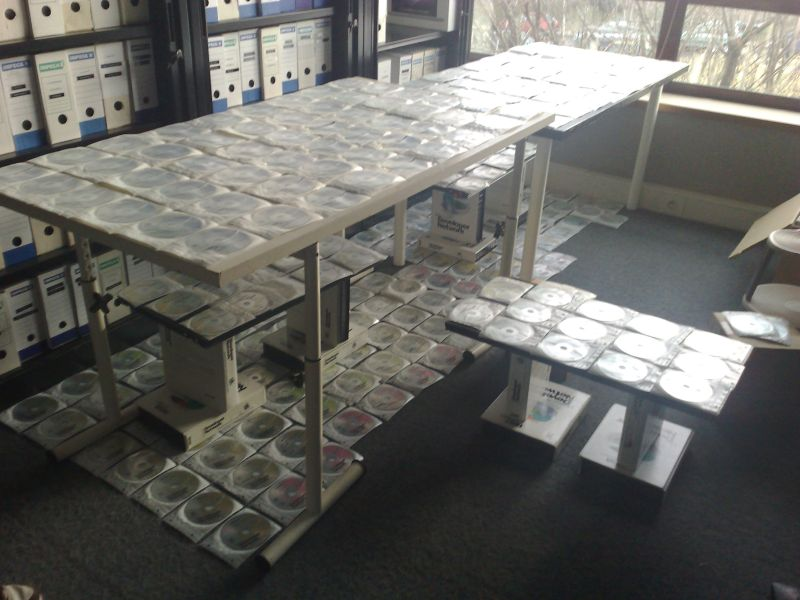

The archive room where one of our poor intern is just trying to sort 4 years of MSDN CDs.

We plan to keep only a few of these, but before, we need to know what we have here. It's an interesting thing to do. At least on the organization point of view (Note the small tables under the main one :D).
